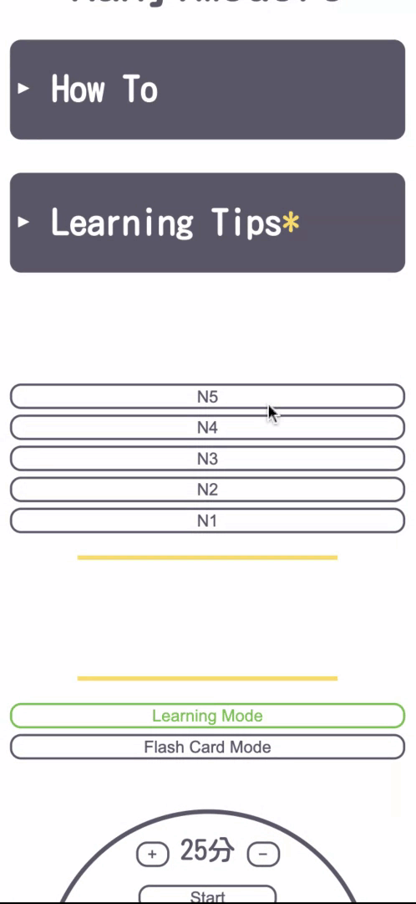
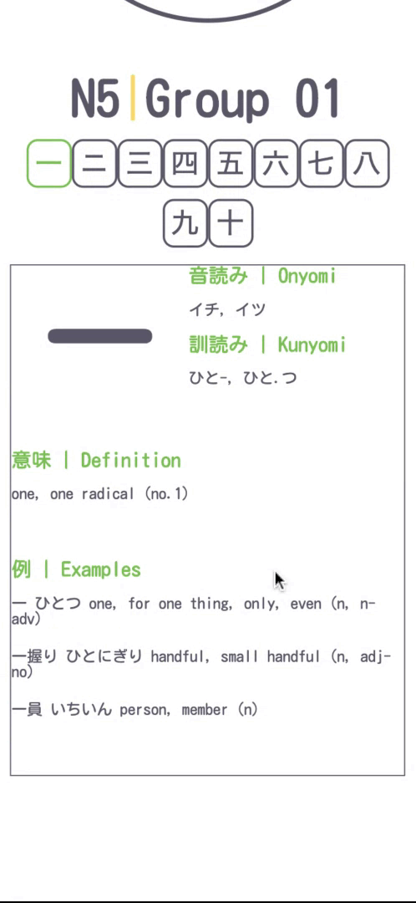
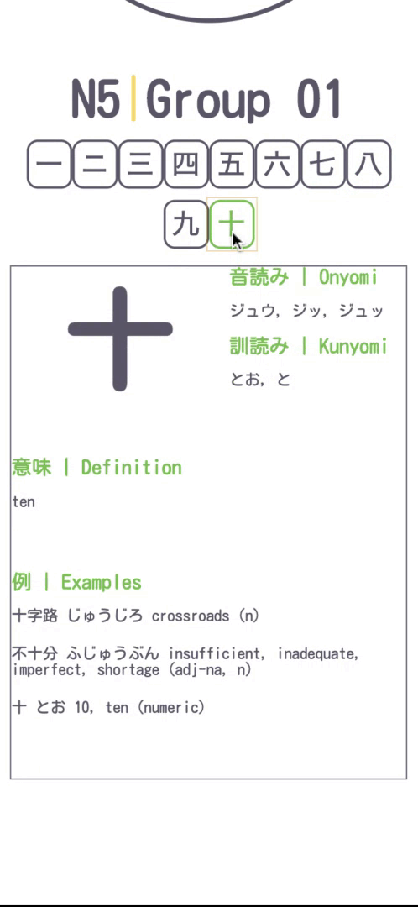

# 漢字 | KanjiModoro
[KanjiModoro](kanjimodoro.com) was created with the intention of helping those studying kanji for the JLPT. By including a pomodoro and small groups of kanji organized by JLPT level, users should be able to better pace their learning and memorization.  

## Table of Contents
1. [Demo](#demo)
2. [Languages Used](#languages-used)
3. [Version](#version)
4. [Features](#features)
   * [MVP Features](#mvp-features)
   * [Weeds & Flowers](#weeds-&-flowers)
5. [Author](#author)
6. [Acknowledgments](#acknowledgments)
7. [Notes](#notes)

## [Demo](#demo)  
### KanjiModoro - How To & Tips  
   

### KanjiModoro - Selecting A Level & Groups + Starting Your Pomodoro  
  

### KanjiModoro - Selecting A Kanji Character  
  

### KanjiModoro - Selecting Flash Card Mode 
  

## [Languages Used](#languages-used)
HTML5   
CSS  
JavaScript  

## [Version](#version)
Beta   

## [Features](#features)
The following is a list of features used to create an easy-to-use design. Weeds & Flowers are a list of features deemed as extra or not a top priority to fix. All unchecked items are features yet to be added or updated.

### [MVP Features](#mvp-features)
- [x] User can select a level
- [x] User can select a group of 10 kanji characters to study
- [x] User can select a specific kanji in the current group
- [x] User can select a mode : Learning Mode or Flash Card Mode (default is set to Learning Mode)
- [ ] **Need To Fix :** Refactor code!!! 
- [ ] **Need To Fix :** Data!!!  
    - [x] Entered data for N5-N3; some examples need further review for accuracy
    - [ ] N2 and N1 data needs to be entered in
    - [ ] Will use KanjiAlive API in next version for card data
- [ ] **Need To Fix :** Flash Card Mode is not working on mobile
- [ ] **Need To Fix :** Currently flash card is set to flip on hover for non mobile devices, and on click for mobile devices but it flips only one time and doesn't got back unless user clicks outside of the card
- [ ] Create a development branch to push changes to
- [ ] Choose open source license and create contribution file
- [x] Mobile responsive
- [x] Added alert box to notify users of site status

### [Weeds & Flowers](#weeds-&-flowers)
- [ ] **Need To Fix :** Kanji buttons styling - the dynamically created buttons look like they are missing their margin
- [ ] **Need To Fix :** The group 01 and 11 buttons (and some others) shrink before other buttons depending on size of the screen
- [ ] Improve card style/arrangement 
- [ ] "Pomodoro Complete! Take a mini break" message (use the turtle!)
- [ ] Random order of cards within group of 10 option
- [ ] How To and Tips arrow animation
- [ ] Group buttons have 3 click modes, first is selected (showing that kanji's card info), 2 is reviewed (marking that this group has been viewed), 3 is reset
- [ ] The header turtle message box "Take your time, do it right." "Slow and steady wins the race." on hover, but have move across the top back and forth slowly, continuously
- [ ] Add animation to last Asterisk after turtle jump animation
- [ ] Flag/report a card for incorrect information
- [ ] Add settings so users can choose what information they want the cards to show
- [ ] Lists of data users can download (in different formats)

## [Author](#author)
**Marjorie Etienne**   
@schmarj3  
[MarjorieEtienne.com](marjorieetienne.com)

## [Acknowledgments](#acknowledgments)
* [WhollyCoders](http://www.whollycoders.org) - My mentor at WhollyCoders helped me get around some of my major road blocks for this project, as well as encourage me to keep going until the end :)

## [Notes](#notes)
[KanjiModoro.com](kanjimodoro.com)  
This site is hosted on GitHub  
**Constructive** feedback is welcome! I am a new developer, and have a lot to learn, so please share!
